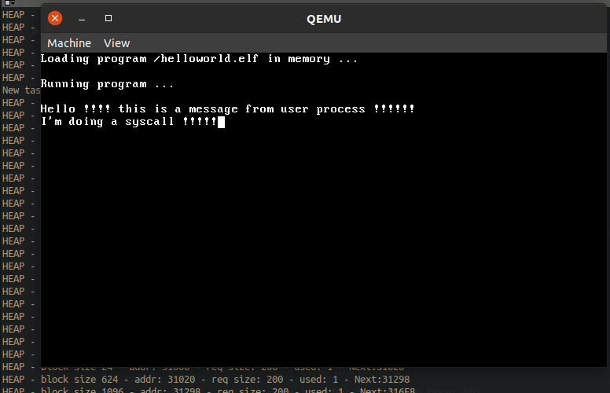

# minios
A very simple operating system for i386 with its own bootloaded, just for self learning.
So far these features are implemented (barely):
* bootloader with available memory detection.
* Basic chipset and buses: PCI, PIC, PIT, Serial, PS/2 in progress.
* Basic raw console
* base libraries: strings, heap, string/int conversion, etc.
* IDE harddisk (read only, no IRQ, no DMA).
* Virtual file system layer.
* ext2 filesystem (readonly so far).
* Elf binary support - no shared libraries.
* Paging.
* Context switching.
* Process loading and execution.
* Loadable kernel modules, used for device drivers.
* Barebones userspace C library.
* Minimall command line interface.
* System calls for:
  * Open/close/read files, directories and stream handling.
  * Exit current process.
  * Yield process.
  * Spawn processes.
  * Wait for process finalization.



## Requirements
* gcc
* nasm
* qemu

## Build it
Run ```make```

## Test it
Run ```make test```

## Debug it
Run ```make debug```
From another console, you can connect with gdb at port 1234 of localhost.

## Debug messages
Port 0x08 (COM1) of guest is used for debugging purposes, it is sent to host console (on test target), or to file minios.log (on debug target).
