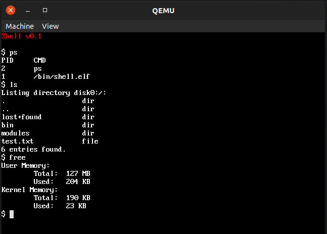

# minios
A very simple operating system for i386 with its own bootloader, just for self learning.
So far these features are implemented (barely):
* bootloader with available memory detection.
* Basic chipset and buses: PCI, PIC, PIT, Serial, PS/2 in progress.
* Text console and QEMU-compatible graphics mode.
* Keyboard and mouse drivers.
* base libraries: strings, heap, string/int conversion, etc.
* IDE harddisk (read only, no IRQ, no DMA).
* Virtual file system layer.
* ext2 filesystem (readonly so far).
* Elf binary support - no shared libraries.
* Paging.
* Context switching.
* Basic IPC by using message passing.
* Process loading and execution.
* Loadable kernel modules, used for device drivers.
* Simple userspace C library.
* Minimall command line interface.
* System calls for:
  * Open/close/read files, directories and stream handling.
  * Exit current process.
  * Yield process.
  * Spawn processes.
  * Wait for process finalization.
  * Messge passing.



## Requirements
* gcc
* nasm
* qemu

## Build it
Run ```make```

## Test it
Run ```make test```

## Debug it
Run ```make debug```
From another console, you can connect with gdb at port 1234 of localhost.

## Debug messages
Port 0x08 (COM1) of guest is used for debugging purposes, it is sent to host console (on test target), or to file minios.log (on debug target).

## Using it
So far the very first thing the kernel executes on user space is a shell interface.

### Shell
The shell supports a very limited set of features. It works pretty much like a regular unix/DOS shell.
The following builtin commants are included
* clear: clear screen
* pwd: shows current directory
* env: shows environment variables
* cd: changes directory (not working yet).
Any other input will be handled as program name. For the moment it executes all programs which are on PATH environment variable (only one single location supported so far).
The default working directory is ```disk0:/```
Executables have .elf extension, although is not needed to write it.
Appending & at the end of the command will cause the executed problem be run in background.

### ls
Shows a given directory.
Syntax:
```$ ls [path]```
Path can be relative, absolute with no drive, or absolute with drive included.

### lsenv
Lists all available devices

### cat
Dumps to console the contents of a given file, syntax:
```$ cat [path]```
